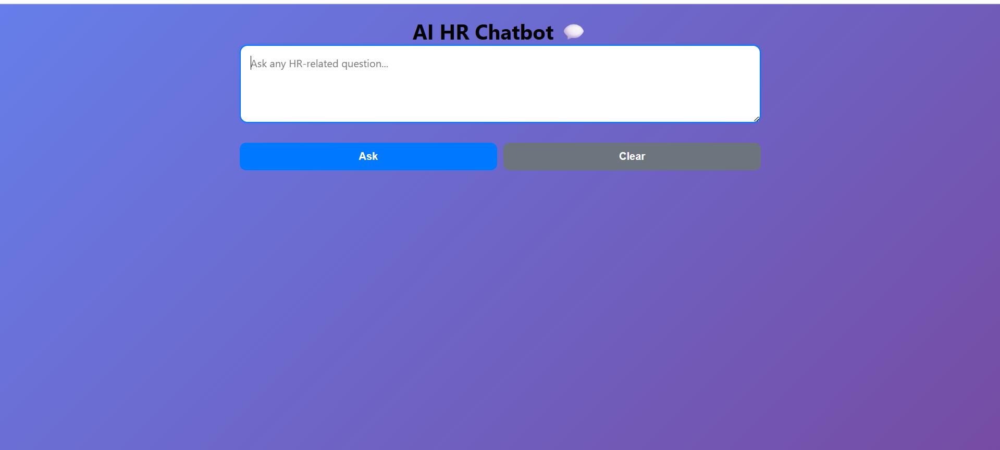
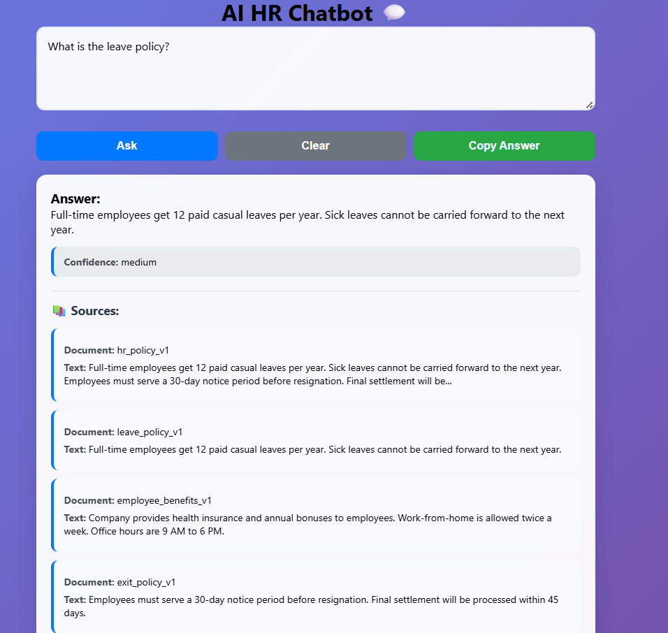
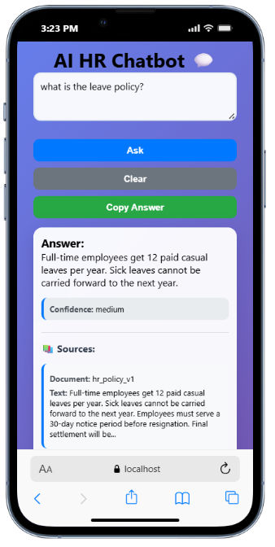
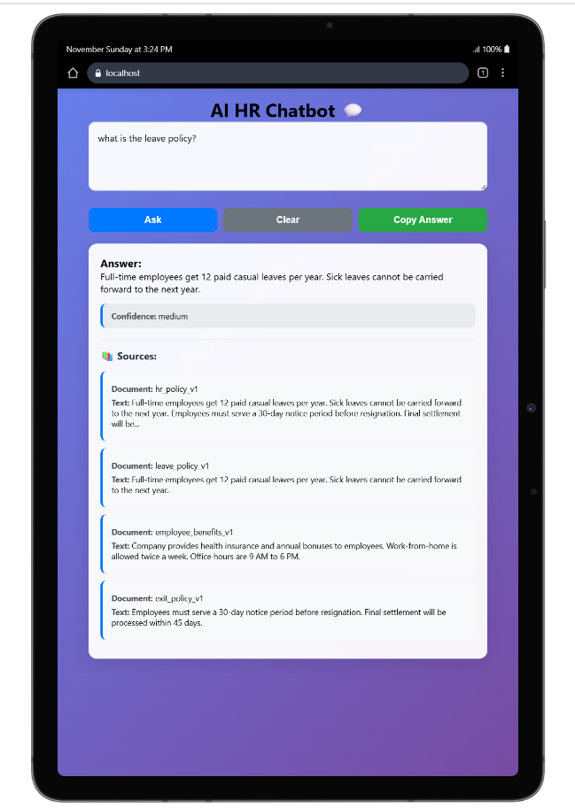
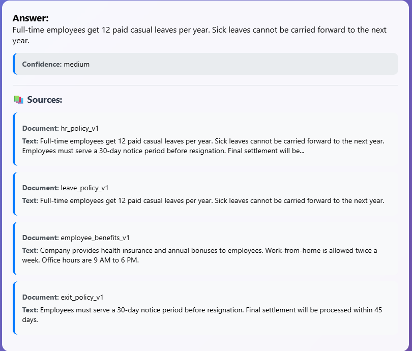

markdown
# AI HR Chatbot 🤖

A secure internal web app that lets employees ask natural-language questions about company policies using AI-powered RAG (Retrieval-Augmented Generation) system.

## Application Screenshots

### Desktop Design


### Main Chat Interface


### Mobile Responsive Design


### Tablet View


### Smart Citation System



## Features

- **I-Powered Answers** - Uses OpenRouter AI with precise prompt guardrails
- **Smart Citation System** - Shows exact sources from policy documents
- **Confidence Scoring** - Indicates answer reliability with HR escalation
- **ile Upload System** - Add new policy documents via `/ingest` endpoint
- **Mobile Responsive** - Works perfectly on all devices

## Tech Stack

**Frontend**: React.js, CSS3, Axios  
**Backend**: FastAPI, LangChain, FAISS, OpenRouter AI  
**Deployment**: Heroku (Backend), Netlify (Frontend)

## Quick Start

### Backend Setup
```bash
cd backend
pip install -r requirements.txt
uvicorn main:app --reload

### Frontend Setup
bash
cd frontend
npm install
npm start


###Project Structure
text
ai-hr-chatbot/
├── backend/ (FastAPI + RAG system)
├── frontend/ (React.js UI)
├── README.md
└── .gitignore


###API Endpoints
POST /ask - Ask HR policy questions

POST /ingest - Upload policy documents

GET /documents - List available policies

POST /feedback - Submit user feedback

GET /healthz - Health check
